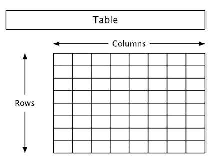
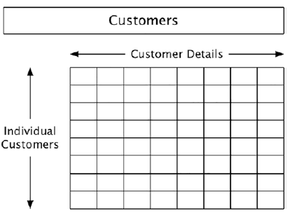

- [Preliminary Database Terminologies](#preliminary-database-terminologies)
  - [I.  Concepts](#i--concepts)
    - [A. Data vs Information vs Values](#a-data-vs-information-vs-values)
    - [B. Database Tables](#b-database-tables)

# Preliminary Database Terminologies

## I.  Concepts

A **database** is a collection of data. But when we’re talking about `SQL`, we’re talking about data which is organized and accessed in a particular way. To begin with, the design of a database follows what is called the **relational model**, which is basically a set of principles about how the data is organized. This model is all about purity and clarity. Each item of data has exactly one place where it belongs and is stored in its purest form. Related items of data are collected together.

> The relational model is the basis of how SQL databases are put together.

---

### A. Data vs Information vs Values

> Databases store **data**. That’s what the name implies, but it’s important to understand that that’s not the same as **information**.

**Data** is neutral. It has no meaning. Your height might be, say, 175 (cm), but the database neither knows nor cares whether that’s good or bad. It’s just a number, and if it’s not correct, it doesn’t care about that either.

What the database does **care about**, however, is [whether the data entered follows any rules predefined in the design of the database](). That might include the type of data entered or the range of possible values.

**Information**, however, is something that humans do. We [assign it a meaning, and we make judgments](). Here, we decide whether the height is what we’d expect or meaningful in some other way.

Why would that be important? Take, for example, your date of birth. Is it possible that it might change?

The short answer is no, you can’t go back and change your date of birth. However, the actual data itself can change, such as when it was entered incorrectly, or there’s been a change to the calendar.

This affects how a database should be designed: [you have to allow for errors](), and [you have to see what reasonableness checks you might need to add to the definitions](). You can’t, for example, lock in the date of birth, just because it’s not supposed to change.

The other concept is the **value**. Think of the data as a question and the value as the answer. What is your given name (data)? The answer is its **value**.

For example, a well-constructed database should only store your given name data exactly once. However, the actual value ("Mark", "John", etc.) might well appear with somebody else’s data. **Values can be repeated, and, if they are, we just regard that as a coincidence**. The real giveaway is that you might change the value of one person’s given name without being obliged to do the same elsewhere.

**Data**
: is a placeholder. It should never be duplicated elsewhere

**Information**
: is the meaning you personally put on the database, and the database neither knows nor cares about that.

**Value**
: is the content of the data. It may be NULL which means that you don't have the value, and it may be duplicated.

### B. Database Tables

> SQL databases store data in one or more **tables**. In turn, a table presents the data in **rows** and **columns**.

> A row is an instance of the data, such as a book in the books table or a customer in the customers table. Columns are used for details, such as the given name of a customer or the title of a book.

SQL Uses the language of tables, and tables have rows and columns

* A **table** is a *collection*, such as collection of customers
* A **row** is an instance or member of that collection, such as one of the customers
* A **column** is a detail of the members, such as the date of birth of the customer.

**Data is atomic**
: In each row, each column stores one piece of data only

**Row order is not significant**
: You can sort them if you like, but the row order has no real significance

**Rows are unique**
: You don't have two rows describing the same thing

**Rows are independent**
: Data in one row shouldn't affect any other row

**Columns are of a single type**
: You can't mix types in a single column

**Column names are unique**
: Details **have** to be unique

**Column order is not significant**
: It shouldn't matter how you select data in a particular order

**Data is stored in the database in a table**
: The data is accessed as rows and columns, in a tabular format

---
<!-- @import "[TOC]" {cmd="toc" depthFrom=1 depthTo=6 orderedList=false} -->

<!-- code_chunk_output -->

- [Preliminary Database Terminologies](#preliminary-database-terminologies)
  - [I.  Concepts](#i--concepts)
    - [A. Data vs Information vs Values](#a-data-vs-information-vs-values)
    - [B. Database Tables](#b-database-tables)

<!-- /code_chunk_output -->
