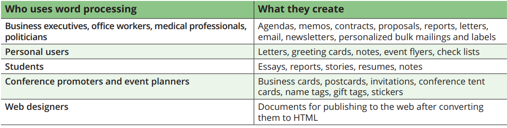
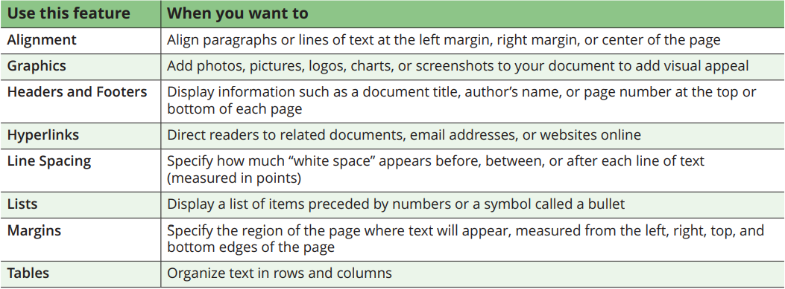
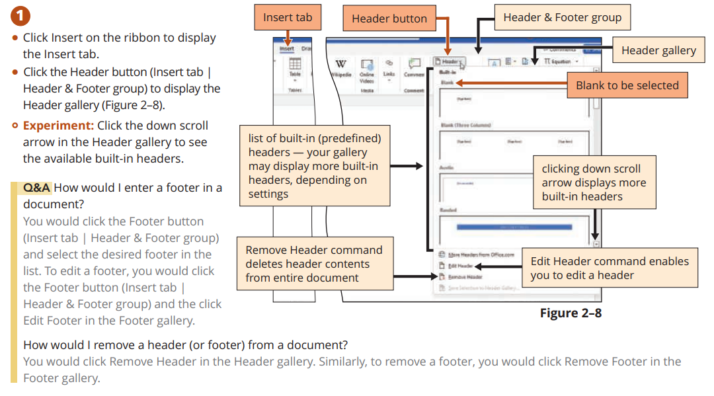
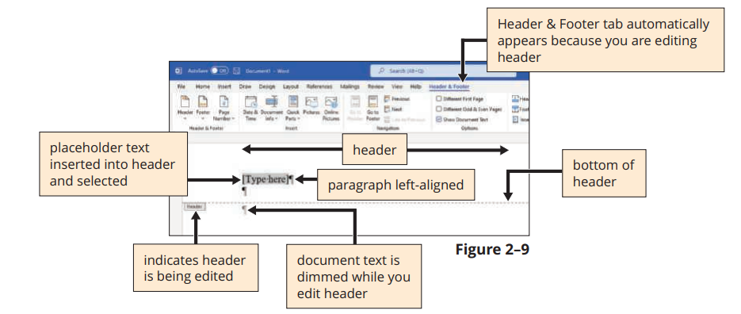
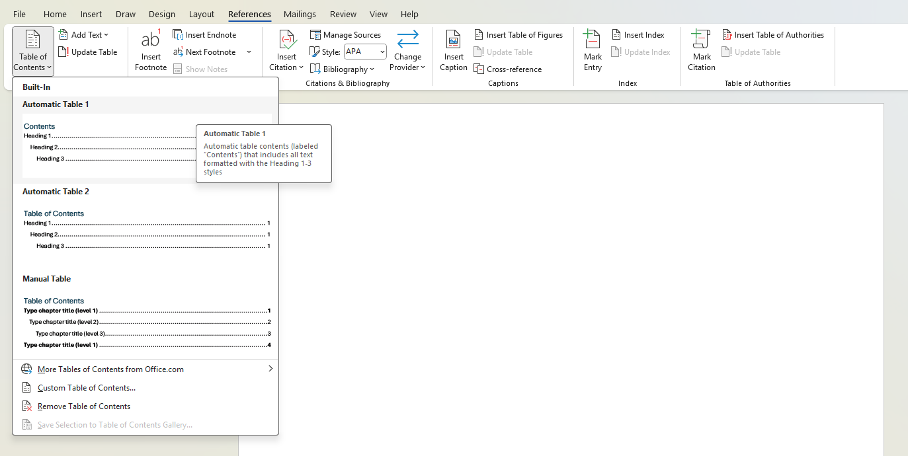
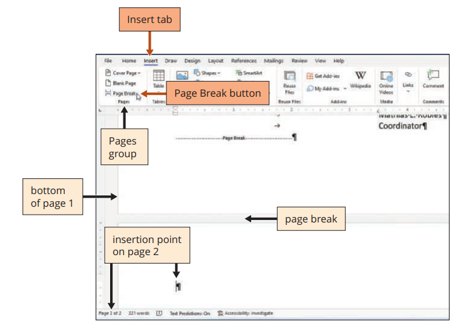
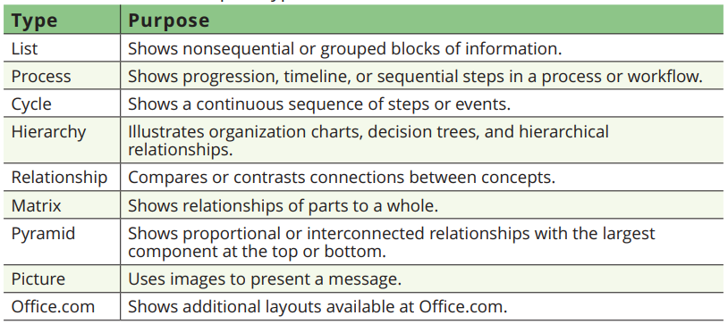
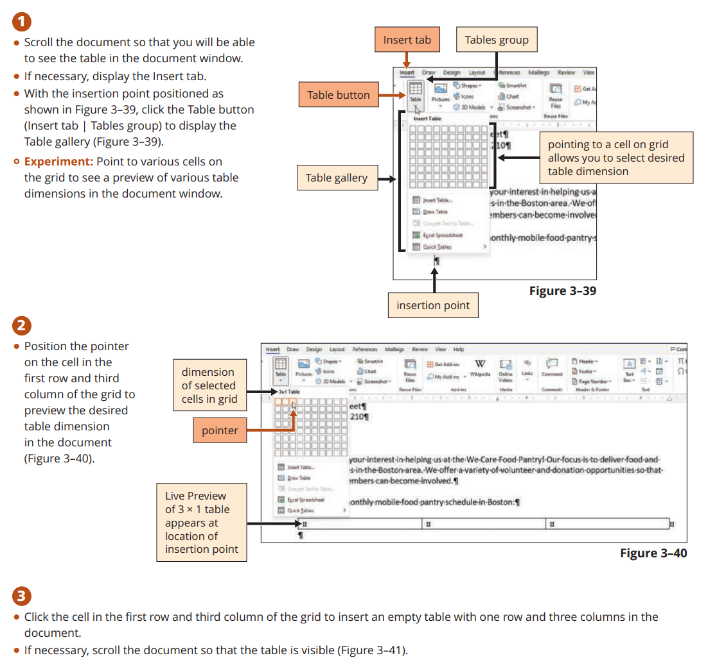
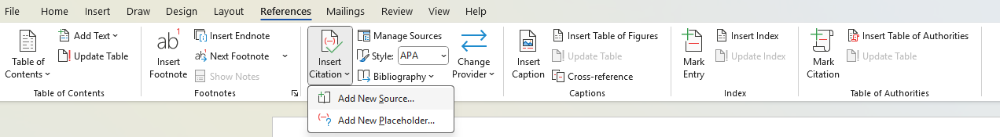
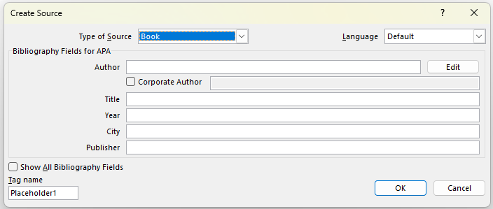

# Using Word Processors

**Word processing** is one of the most widely used types of apps. A word processing app includes tools for entering, editing, and formatting text and graphics. You can create documents and reports, mailing labels, flyers, brochures, newsletters, resumes, letters, and more. You can enhance your documents to look more professional, as well as share and collaborate with others.

All word processors share some common key features. The electronic files you create are called **documents**. A document can contain only one page or an unlimited number of pages. When you open a word processing program, a blank document opens on the screen. The screen displays an **insertion point**, a blinking vertical line that appears when you click the screen, indicating where new text or an object will be inserted. **Scroll bars** appear on the right edge (vertical scroll bar) and bottom edge (horizontal scroll bar) of a document window to let you view a document that is too large to fit on the screen at once. You can use scroll bars to navigate to view parts of a document that are too large to fit on the screen all at once.

> [!NOTE]
> **Formatting** is the process of changing the appearance of text and objects. You can use formatting to highlight important information and make text easier to read. Text formatting options involve changing the font, size, style, and color of text and adding special effects such as reflection, shadows, and outlining

## I. Structural Foundations

### A. Style-Driven Design

A **header** is text, information, pictures, and other objects that appear in an area above the top margin on one or more page(s) in a document. Similarly, a **footer** is text, information, pictures, and other objects that appear in an area below the bottom margin on one or more page(s) in a document. 

### B. Navigation & Logic

A page (or a set of pages) dedicated for providing a navigation menu to your document is called **Table of Contents**. This entirely depends on the document layout and page numbering, which can be automatically generated from the `References -> Table of Contents` context menu.

### C. Advanced Page Layout

Automatic Page breaks

As you type documents that exceed one page, Word automatically inserts page breaks at the bottom of a page, called automatic page breaks or soft page breaks, when it determines the text has filled one page according to paper size, margin settings, line spacing, and other settings. If you add text, delete text, or modify text on a page, Word recalculates the location of automatic page breaks and adjusts them accordingly.

Manual Page Break

---

## II. Visual & Data Integration

### A. Technical Illustrations

SmartArt Graphics

Microsoft Office includes SmartArt graphics, which are customizable diagrams that you use to pictorially present lists, processes, and relationships.

### B. Functional Tables

Tables

---

## III. Referencing and Automation

### A. Citation Management

> [!IMPORTANT]
> A **citation** is a reference to a source, such as a published work

### C. Document Fields

---